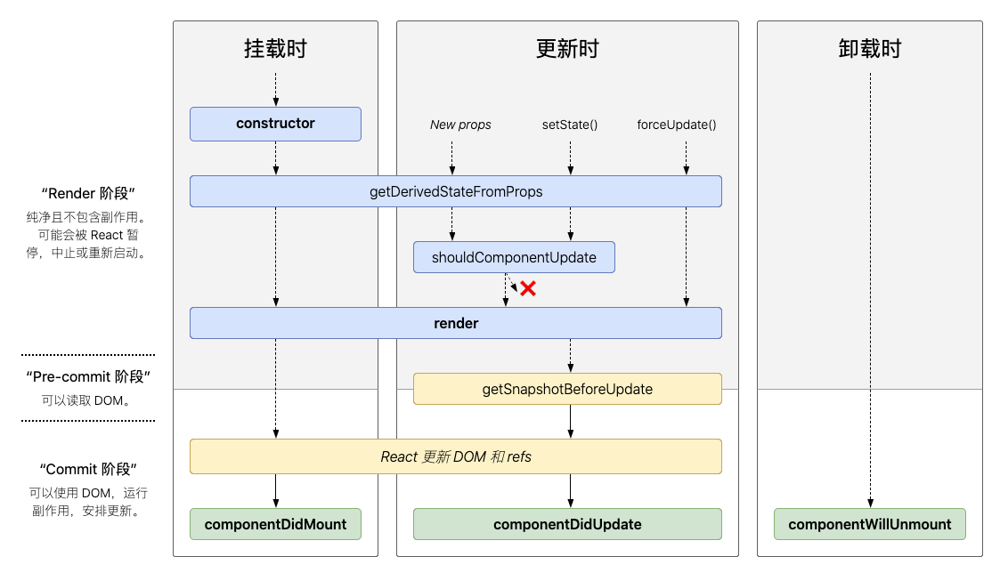

1. 你知道哪些设计模式？
> 这个摆一个菜鸟的链接吧，我个人也不是很了解[传送门](https://www.runoob.com/design-pattern/design-pattern-intro.html)


2. 列举`React`常用生命周期
* `componentWillMount`or`UNSAFE_componentWillMount`: 渲染前调用
* `static getDerivedStateFromProps(props, state)`: 在渲染前调用，并且在初始挂载及后续更新时都会被调用。无权访问组件实例，返回一个对象来更新`state`
* `componentDidMount`: 第一次渲染后调用
* `componentWillReceiveProps(nextProps)`or`UNSAFE_componentWillReceiveProps`: 在`props`更改时重新计算某些数据。在已挂载的组件接收新的`props`之前被调用。
* `shouldComponentUpdate(nextProps, nextState)`: 返回一个布尔值来决定当前`React`组件是否受当前`state`或`props`的更改影响。
* `static getSnapshotBeforeUpdate(prevProps, prevState)`: 在最近一次渲染输出之前调用。此生命周期的任何返回值将作为参数传递给`componentDidUpdate`
* `componentWillUpdate(nextProps, nextState)`or`UNSAFE_componentWillUpdate`: 当组件收到新的`props`或`state`时，会在渲染前调用，初始渲染不会调用。不可在此方法中调用`setState`或执行`redux`操作。
* `componentDidUpdate`: 更新后立即调用。首次渲染不会执行此方法。可以在此生命周期中使用`setState`, 但要包裹在条件语句中，否则会形成死锁
* `componentwillUnmount`: 当组件从`DOM`中移除时会调用
* `componentDidCatch(error: 错误, info: 带有componentStack key的对象)`: 提交阶段调用， 可以用于记录错误。 
* `static getDerivedStateFromError(error)`: 在后代组件抛出错误时调用，并返回一个值更新`state`
```js
// 挂载过程生命周期调用过程
constructor()
componentWillMount()
static getDerivedStateFromProps()
render()
componentDidMount()

// 更新
static getDerivedStateFromProps()
UNSAFE_componentWillReceiveProps()
UNSAFE_componentWillUpdate()
render()
static getSnapshotBeforeUpdate()
componentDidUpdate()

// 卸载
componentwillUnmount()

// 错误
static getDerivedStateFromError()
componentDidCatch()
```

3. `React`的`render`函数在何时执行？
见第二问

4. `React`在`componentWillUpdate`中可以调用`setState`么？
见第二问

5. `React`的合成事件和原生事件的区别？
* `SyntheticEvent`是浏览器的原生事件的跨浏览器包装器。除兼容所有浏览器外，它还拥有和浏览器原生事件相同的接口。包含`stopPropagation`和`preventDefault`。
* `SyntheticEvent`是合并而来的。所以该对象可能会被重用，并且在事件回调函数被调用后，所有的属性都会无效。故不可通过异步访问事件。
* 事件均在冒泡阶段被触发，如若注册捕获阶段的事件处理函数，则应为事件名添加`Capture`: `onClickCapture`

6. `onmouseover`和`onmouseenter`哪个会触发冒泡，对应的移出事件是什么？
* `onmouseover`会触发冒泡
* `onmouseover -> onmouseout`, `onmouseenter -> onmouseleave`

7. 事件冒泡和捕获
* 执行顺序
- 冒泡: 从内到外(事件元素 => `document`)
- 捕获: 从外到内(`document` => 事件元素)

* `addEventListener(event, function, useCapture)`
- useCapture: 默认为`false`。若设置为`true`则表示在捕获阶段调用

8. `https`常用端口是多少？
443

9. 
